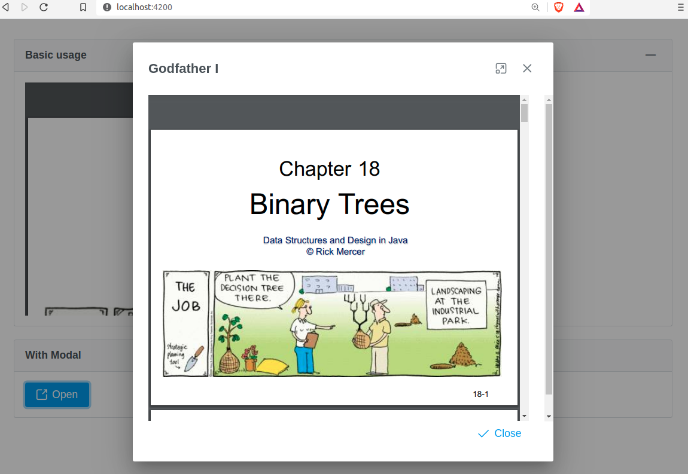

# Primeng + NgxDocViewer

The goal is to combine [primeng](https://primefaces.org/primeng/showcase/#/setup) with [ngx-doc-viewer](https://www.npmjs.com/package/ngx-doc-viewer) and show pdf files on the browser, prime-dialog

This project was generated with [Angular CLI](https://github.com/angular/angular-cli) version 11.0.7.

## Development server

Online PDF show: [https://www2.cs.arizona.edu/~mercer/Presentations/18-BinaryTrees.pdf](https://www2.cs.arizona.edu/~mercer/Presentations/18-BinaryTrees.pdf)

If you have any problem, please change the field: `pdfOption` on `src/app/app.component.ts`

Run `ng serve` for a dev server. Navigate to `http://localhost:4200/`. The app will automatically reload if you change any of the source files.

##  Expected output

## Credits

* [primefaces-getting-started](https://primefaces.org/primeng/showcase/#/setup)
* [ngx-doc-viewer](https://www.npmjs.com/package/ngx-doc-viewer)